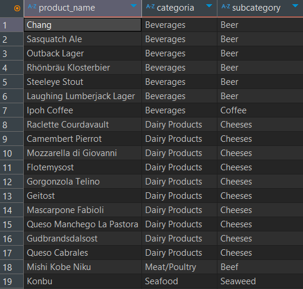

# UF1472--PRUEBA-PRACTICA

# Proyecto Northwind PostgreSQL - Backup Original con Personalizaciones

Este repositorio contiene una versión mejorada del clásico dataset Northwind adaptado para PostgreSQL, con funciones analíticas avanzadas y extensiones modernas a nivel de vistas y columnas JSON.

## 📋 Descripción del Proyecto

Se ha tomado el backup de la base de datos Northwind y se han incorporado personalizaciones útiles para el análisis y visualización de datos empresariales.

### ✨ Características Principales

- **Campo JSON en Productos**: Columna `categoryjson` para metadatos dinámicos
- **Vistas Analíticas**: Métricas avanzadas sobre ventas, stock, proveedores y clientes
- **Consultas listas para BI**: Visualizaciones por país, por mes, y por ciudad
- **Backup limpio y listo para restaurar** con PostgreSQL 17+

## 🛠️ Tecnologías

- **PostgreSQL** 17.4
- **pgAdmin** (opcional)
- **psql** para restauración desde consola
- **SQL Dump** (`backup_northwind.sql`)

## 📁 Estructura del Repositorio

```
northwind-postgres-backup/
├── README.md # Este archivo
├── backup_northwind.sql # ⭐ DUMP COMPLETO DE LA BD
├── docs/
│ └── vistas.md # Explicación vistas
└── screenshots/ # Capturas de pantalla
```

## 🚀 Instalación Rápida

### Requisitos

- PostgreSQL versión 12 o superior (idealmente 17)
- Acceso a terminal o cliente pgAdmin

### Instrucciones

1. **Clonar el repositorio**

```bash
git clone https://github.com/tu-usuario/UF1472--PRUEBA-PRACTICA
cd UF1472--PRUEBA-PRACTICA
```

2. **Creación de la base de datos**

```bash
createdb -U postgres northwind
```

3. **Restaurar el dump**

```bash
psql -U postgres -d northwindo -f backup_northwind.sql
```

### Alternativa usando pgAdmin u otro cliente

1. **Crear base de datos llamada northwind**
2. **Abrir query tools o el equivalente en otros clientes**
3. **Copiar, pegar y ejecutar el contenido de backup_northwind.sql**

## 🔍 Funcionalidades Destacadas

1. **Columna JSON en products**

   Esta consulta muestra el nombre del producto, su categoria y subcategoria de los productos que su subcategoria contenga doble e.

```sql
SELECT product_name, categoryjson ->> 'categoria' as categoria  , categoryjson ->> 'subcategoria' as subcategory
FROM Products
WHERE categoryjson ->> 'subcategoria' ilike '%ee%'
order by 2, 3;
```



2. **Control de stock bajo**

   Vista para ver los productos que tengan stock por debajo de cierta cantidad y se sigan vendiendo.

```sql
create view vw_stock_bajo as
select product_name, units_in_stock
from products
where units_in_stock <= reorder_level and discontinued = 0
order by 2;
```

```sql
SELECT * FROM vw_stock_bajo;
```

3. **Rendimiento por proveedor**

```sql
create view vw_performance_proveedores as
select 	s.company_name  as "nombre de la compañia",
		s.country  as "pais",
		s.city  as "ciudad",
		count(p.product_id)  as "cantidad de productos que ofrece",
		sum(od.quantity) as "total de unidades vendidas de sus productos",
		round(sum((od.unit_price * od.quantity) * (1 - od.discount))::numeric, 2) as "total generado",
		max(o.order_date) as "fecha de la ultima venta de uno de sus productos"
from suppliers s
join products p on s.supplier_id = p.supplier_id
left join order_details od on p.product_id = od.product_id
left join orders o on od.order_id = o.order_id
group by s.company_name, s.country, s.city
order by "total generado" desc nulls last;
```

```sql
SELECT * FROM vw_performance_proveedores
limit 5;
```

## 📊 Vistas Incluidas

- `vw_ventas_mes` - Ventas mensuales
- `vw_ventas_diarias` - Ventas diarias
- `vw_ventas_empleado` - Ventas por empleado
- `vw_top_productos` - Productos más vendidos
- `vw_top_clientes` - Clientes que han comprado más
- `vw_ventas_categoria` - Ventas por categoría
- `vw_ventas_pais` - Ingresos por país
- `vw_ordenes_ciudad` - Pedidos por ciudad
- `vw_stock_bajo` - Productos en stock crítico
- `vw_precios_categoria` - Rango de precios por categoría
- `vw_analisis_clientes` - Métricas de clientes
- `vw_ordenes_detalladas` - Ordenes detalladas
- `vw_performance_proveedores` - Ranking de proveedores

## 🧪 Validar la Instalación

Verifica las vistas con estas consultas:

```sql
SELECT * FROM vw_ventas_mes LIMIT 5;
SELECT * FROM vw_top_clientes LIMIT 5;
SELECT * FROM vw_ventas_categoria;
```
